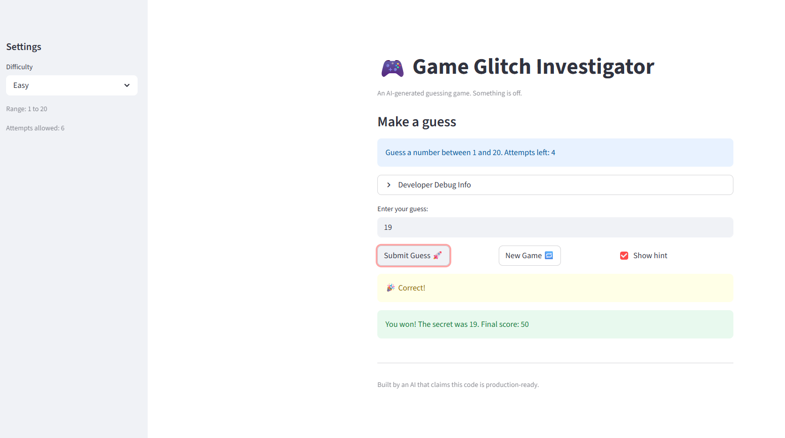
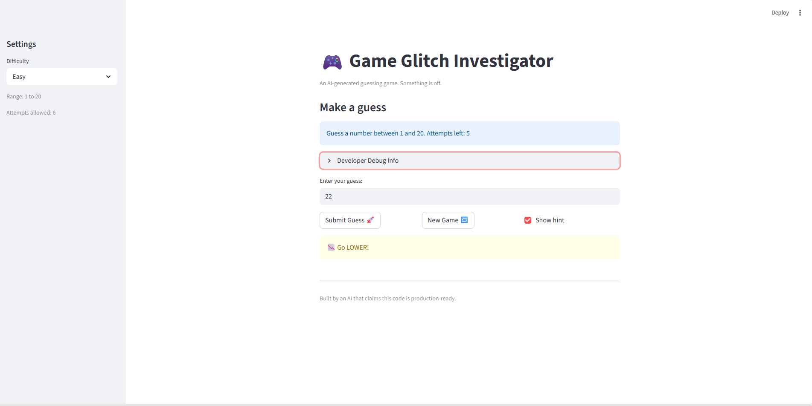

# 🎮 Game Glitch Investigator: The Impossible Guesser

## 🚨 The Situation

You asked an AI to build a simple "Number Guessing Game" using Streamlit.
It wrote the code, ran away, and now the game is unplayable. 

- You can't win.
- The hints lie to you.
- The secret number seems to have commitment issues.

## 🛠️ Setup

1. Install dependencies: `pip install -r requirements.txt`
2. Run the broken app: `python -m streamlit run app.py`

## 🕵️‍♂️ Your Mission

1. **Play the game.** Open the "Developer Debug Info" tab in the app to see the secret number. Try to win.
2. **Find the State Bug.** Why does the secret number change every time you click "Submit"? Ask ChatGPT: *"How do I keep a variable from resetting in Streamlit when I click a button?"*
3. **Fix the Logic.** The hints ("Higher/Lower") are wrong. Fix them.
4. **Refactor & Test.** - Move the logic into `logic_utils.py`.
   - Run `pytest` in your terminal.
   - Keep fixing until all tests pass!

## 📝 Document Your Experience

- [ ] This is a guessing game with numbers, which is built using python, and hosted in streamlit.Player tries to guess a secret number within a difficulty-determined range (Easy: 1–20, Normal: 1–100, Hard: 1–500) before running out of attempts. Correct guesses earn points; wrong guesses cost points.
- [ ] Detail which bugs you found.
Here is a clean, copy‑ready **Markdown** version you can paste directly into your README. It keeps your structure but formats it professionally and consistently.

---

## 🐞 Bugs Found (5 Total)

| # | Bug | Location |
|---|-----|----------|
| 1 | Reversed hints — “Too High” showed **“Go HIGHER!”** and “Too Low” showed **“Go LOWER!”** | `check_guess` in `app.py` |
| 2 | Wrong guesses rewarded — `update_score` added **+5 points** on even-numbered wrong guesses instead of always subtracting | `update_score` in `app.py` |
| 3 | Attempts started at 1 — `st.session_state.attempts` initialized to **1 instead of 0**, skewing attempt count | `app.py:34` |
| 4 | New game ignored difficulty — “New Game” always used `randint(1, 100)` regardless of selected difficulty | New game handler in `app.py` |
| 5 | Hardcoded range in info message — always displayed **“Guess a number between 1 and 100”** even on Easy/Hard | Info message in `app.py` |

---
- [ ] Explain what fixes you applied.
## Fixes Applied

- Refactored all four logic functions (`get_range_for_difficulty`, `parse_guess`, `check_guess`, `update_score`) from `app.py` into `logic_utils.py`, replacing `NotImplementedError` stubs.  
- Corrected hint logic in `check_guess`:  
  - `guess > secret` → **“Go LOWER!”**  
  - `guess < secret` → **“Go HIGHER!”**  
- Corrected scoring in `update_score`: wrong guesses now **always deduct 5 points**.  
- Fixed attempt counter: initialized to **0** instead of 1.  
- Fixed new‑game behavior: now uses `random.randint(low, high)` based on selected difficulty.  
- Fixed info message: dynamically displays **“Guess a number between {low} and {high}.”**  
- Updated tests to assert full tuple returns and added edge‑case coverage.

## 📸 Demo
The following image showcase 3 different outputs tested as well.
- 

